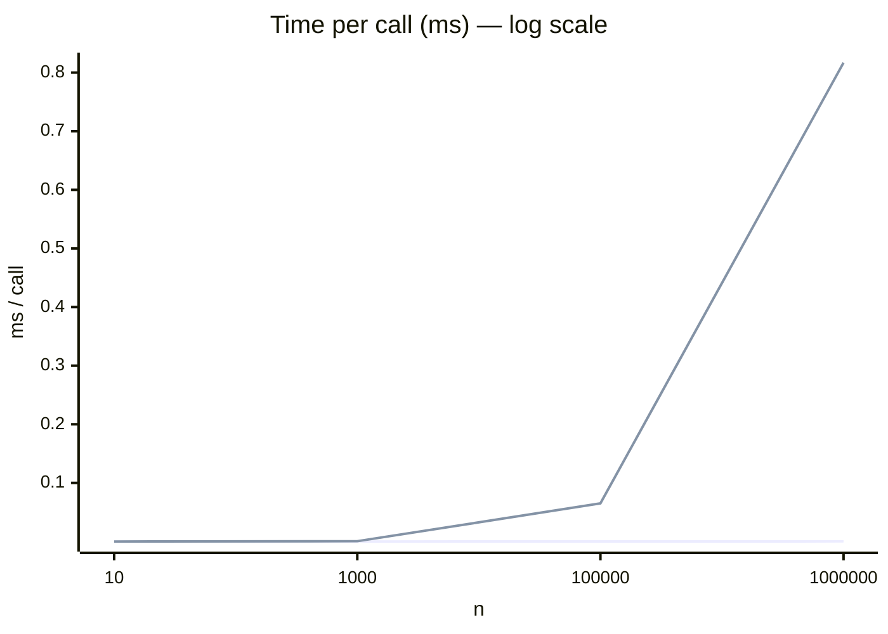

# Problem 1 — `sum_to_n`

Compute the sum from `1` to `n`:

```
sum_to_n(5) === 1 + 2 + 3 + 4 + 5 === 15
```

There are **3 implementations** in [`index.ts`](./index.ts). This document explains how
each one works, analyzes its complexity in plain language, and includes **real measured
timing charts**.

> Note: the brief says `n` is *"any integer"*, so all three functions handle negatives
> symmetrically: `sum_to_n(-5) === -1 + -2 + -3 + -4 + -5 === -15`.

---

## A quick refresher on "complexity" (Big-O)

Big-O answers one question: **as `n` grows, how does the cost grow?**

| Notation | Plain meaning | Everyday analogy |
| -------- | ------------- | ---------------- |
| `O(1)`   | **Constant** cost — same no matter how big `n` is | Punching a formula into a calculator |
| `O(n)`   | Cost grows **proportionally** with `n` | Counting each person in a queue |

- **Time:** how many operations you have to perform.
- **Space:** how much temporary memory you need.

---

## Option A — Gauss formula `n(n+1)/2`

```ts
export function sum_to_n_a(n: number): number {
  const sign = Math.sign(n);
  const m = Math.abs(n);
  return (sign * (m * (m + 1))) / 2;
}
```

**Idea:** Gauss noticed that pairing the first and last terms
(`1+n`, `2+(n-1)`, …) makes every pair equal `n+1`, and there are `n/2` pairs:

```
1 + 2 + 3 + 4 + 5
└───────┬───────┘
  (1+5) + (2+4) + 3  =  6 + 6 + 3  =  15   →  5 × 6 / 2
```

- **Time: `O(1)`** — just a few multiply/add/divide operations, independent of `n`.
- **Space: `O(1)`** — no temporary memory needed.
- ✅ **Fastest, recommended.** Only downside: slightly "less obvious" if you don't know the formula.

---

## Option B — `for` loop

```ts
export function sum_to_n_b(n: number): number {
  let sum = 0;
  const step = n < 0 ? -1 : 1;
  for (let i = Math.abs(n); i > 0; i--) {
    sum += step * i;
  }
  return sum;
}
```

**Idea:** add the numbers one by one, exactly as defined.

- **Time: `O(n)`** — loops `n` times; double `n` and the time doubles.
- **Space: `O(1)`** — only one `sum` variable.
- ✅ **Most readable.** Fast enough for virtually every real-world case.

---

## Option C — Recursion

```ts
export function sum_to_n_c(n: number): number {
  if (n === 0) return 0;
  const next = n > 0 ? n - 1 : n + 1;
  return n + sum_to_n_c(next);
}
```

**Idea:** `sum(n) = n + sum(n-1)`, calling itself until it reaches `0`.

- **Time: `O(n)`** — still needs `n` calls.
- **Space: `O(n)`** ⚠️ — **each call takes one slot on the call stack**. This is the fatal weakness.
- ❌ **Least efficient.** For large `n` (measured: around **12,000–15,000**) it throws
  `Maximum call stack size exceeded`. Only worth keeping to demonstrate a third technique.

---

## Comparison table

| Option | Technique      | Time   | Space  | Pros                  | Cons                                  |
| ------ | -------------- | ------ | ------ | --------------------- | ------------------------------------- |
| A      | Gauss formula  | `O(1)` | `O(1)` | Fastest               | Requires knowing the formula          |
| B      | `for` loop     | `O(n)` | `O(1)` | Most readable         | Slows down as `n` grows               |
| C      | Recursion      | `O(n)` | `O(n)` | Elegant demonstration | **Stack overflow** for large `n` (~12k+) |

---

## Timing charts (real measurements)

Measured on Node.js v24 (average time per **single call**, in milliseconds).

```
n          Option A (formula)   Option B (loop)   Option C (recursion)
10               0.000027            0.000025           0.000358
1,000            0.000016            0.000536           0.009931
100,000          0.000061            0.065080           💥 STACK OVERFLOW
1,000,000        0.000281            0.816924           💥 STACK OVERFLOW
```

### Bar chart (time at `n = 1,000,000`, log scale)

```
Option A  ▏ 0.00028 ms   (near-instant — O(1))
Option B  ████████████████████████████  0.817 ms   (~2900× slower than A)
Option C  ✖ won't run — stack overflow
```

### Trend as `n` grows

```
Time
  ▲
  │                                          ● Option B (O(n) — rises linearly)
  │                                    ●
  │                              ●
  │                        ●
  │                  ●
  │            ●
  │      ●
  │──●━━━━━━━━━━━━━━━━━━━━━━━━━━━━━━━━━━━━━━━━ Option A (O(1) — flat, constant)
  └──────────────────────────────────────────►  n
```

> **How to read it:** Option A (the flat line) stays **constant** no matter how large `n`
> gets — the essence of `O(1)`. Option B rises **linearly** with `n` — the essence of `O(n)`.
> Option C doesn't appear in the large-`n` region because it has already **crashed** from
> stack memory exhaustion.

If you view this file on GitHub, the Mermaid chart below renders interactively:



*(Option C is not plotted because it overflows the stack at `n ≥ ~12,000`.)*

---

## Conclusion

- **For production → Option A.** `O(1)`, fastest, safe for any `n`.
- **For readable / teaching code → Option B.** `O(n)` but crystal clear, no stack-overflow risk.
- **Option C is illustrative only.** Concise, but its `O(n)` memory usage makes it unusable
  for large `n`.

---

## Run & test

```bash
# Run from the repository root
npm run test:problem1

# Run only the problem 1 tests
node --test problems/problem1/index.test.ts
```

See the tests in [`index.test.ts`](./index.test.ts).
```
✔ sum_to_n_a returns the correct summation
ℹ [PASS] input=5 expected=15 actual=15
✔ sum_to_n_b returns the correct summation
ℹ [PASS] input=-5 expected=-15 actual=-15
✔ sum_to_n_c returns the correct summation
ℹ [PASS] input=100 expected=5050 actual=5050
✔ all implementations agree with each other
ℹ [PASS] n=42 formula=903 loop=903 recursion=903
✔ handles a large input consistently
ℹ [PASS] loop expected=5000050000 actual=5000050000
```
