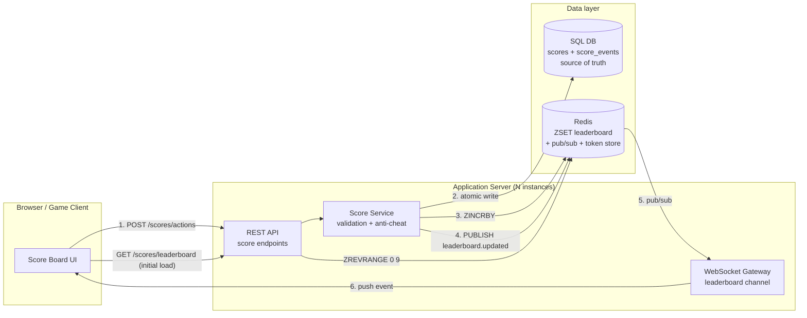
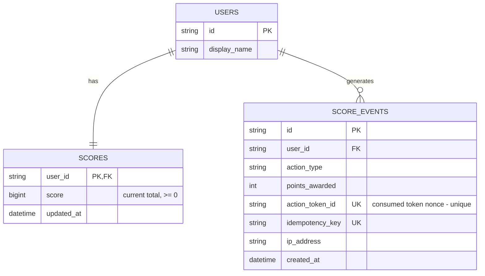
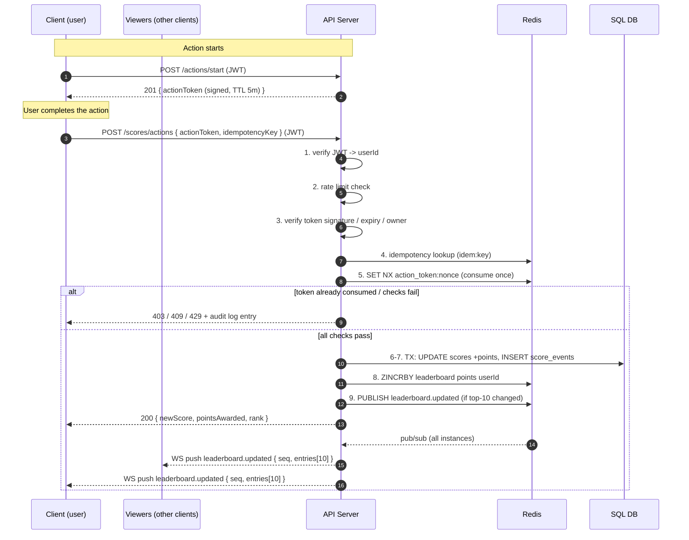

# Problem 6 — Score Board API Module Specification  <!-- omit in toc -->

> **Audience:** backend engineering team.
> **Status:** specification only — no code in this folder. This document is the single
> source of truth for implementing the module; the diagrams are duplicated as editable
> sources in [`diagrams/`](diagrams/).

## Table of Contents  <!-- omit in toc -->

- [1. Overview](#1-overview)
	- [Scope](#scope)
	- [Assumptions](#assumptions)
- [2. Requirements](#2-requirements)
	- [Functional](#functional)
	- [Non-functional](#non-functional)
- [3. Architecture](#3-architecture)
	- [Components](#components)
- [4. API Specification](#4-api-specification)
	- [4.1 `POST /api/v1/scores/actions` — report a completed action (score increase)](#41-post-apiv1scoresactions--report-a-completed-action-score-increase)
	- [4.2 `POST /api/v1/actions/start` — obtain an action token](#42-post-apiv1actionsstart--obtain-an-action-token)
	- [4.3 `GET /api/v1/scores/leaderboard` — top 10](#43-get-apiv1scoresleaderboard--top-10)
	- [4.4 `GET /api/v1/scores/me` — current user's score and rank](#44-get-apiv1scoresme--current-users-score-and-rank)
	- [4.5 Live update channel — WebSocket `/ws`](#45-live-update-channel--websocket-ws)
- [5. Data Model](#5-data-model)
- [6. Execution Flow](#6-execution-flow)
- [7. Security & Anti-Cheat (requirement 5)](#7-security--anti-cheat-requirement-5)
- [8. Additional Comments / Suggested Improvements](#8-additional-comments--suggested-improvements)
- [9. Definition of Done (for the implementing team)](#9-definition-of-done-for-the-implementing-team)

## 1. Overview

The **Score Board API Module** is a backend module of the application server that:

1. Accepts authenticated "action completed" reports from clients and increases the
   acting user's score accordingly.
2. Serves the **top 10** user scores for the website's score board.
3. Pushes **live updates** of the score board to all connected clients.
4. Prevents malicious users from increasing scores without authorisation.

### Scope

| In scope | Out of scope |
| --- | --- |
| Score update endpoint and its validation/anti-cheat pipeline | What the "action" actually is (game move, quiz answer, …) |
| Top-10 leaderboard read API | User registration / login flows (an auth service already issues JWTs) |
| Real-time broadcast of leaderboard changes | Front-end rendering of the score board |
| Persistence and audit trail of score changes | Payments, rewards, or anything triggered *by* a score change |

### Assumptions

- Users are already authenticated; every API call carries a **JWT access token**
  (issued by the existing auth service) identifying the user (`sub` claim).
- Scores only **increase** (monotonic). Each action type has a fixed, server-side
  point value.
- Expected load: read-heavy (many viewers of the board) with bursty writes.

## 2. Requirements

### Functional

| ID | Requirement |
| --- | --- |
| F1 | Show the top 10 users by score (`GET /leaderboard`). |
| F2 | The score board updates live — connected clients see changes without refreshing. |
| F3 | Completing an action dispatches an API call that increases the user's score. |
| F4 | The server, not the client, decides how many points an action is worth. |
| F5 | Unauthorised or forged score increases must be rejected and logged. |

### Non-functional

| ID | Requirement |
| --- | --- |
| N1 | Leaderboard reads: p99 < 50 ms (served from an in-memory read model). |
| N2 | Live update fan-out latency: < 1 s from accepted write to client event. |
| N3 | Score writes are atomic and idempotent — retries never double-count. |
| N4 | Every score mutation is auditable (who, what, when, from where). |
| N5 | Horizontally scalable — no server-local state that breaks with 2+ instances. |

## 3. Architecture



### Components

| Component | Responsibility |
| --- | --- |
| **REST API layer** | HTTP routing, JWT verification, request validation (schema), rate limiting. |
| **Score Service** | Business rules: action-token verification, idempotency, point calculation, atomic persistence, event publishing. Pure module — no HTTP concerns. |
| **WebSocket Gateway** | Manages client subscriptions to the `leaderboard` channel; relays events received via Redis pub/sub. Any instance can serve any client. |
| **SQL database** | Source of truth. `users`, `scores`, `score_events` (append-only audit log). |
| **Redis** | (a) Sorted-set read model for the top 10, (b) pub/sub bus for fan-out across server instances, (c) single-use action-token / idempotency store. |

**Why a Redis sorted set for the leaderboard?** `ZINCRBY` on write and
`ZREVRANGE 0 9 WITHSCORES` on read are O(log N) / O(10); the DB is never queried on
the hot read path. The ZSET is a disposable read model — if Redis is flushed it is
rebuilt from the `scores` table at startup.

**Why WebSocket (recommended) for live updates?** Bidirectional, widely supported,
and one connection serves both the leaderboard channel and future features.
**SSE** is an acceptable simpler alternative (uni-directional is enough here);
**short polling** is the fallback only if operational constraints forbid persistent
connections. The spec below is transport-agnostic where possible.

## 4. API Specification

All endpoints are prefixed with `/api/v1`. All requests require
`Authorization: Bearer <JWT>` unless stated otherwise. Content type is JSON.

### 4.1 `POST /api/v1/scores/actions` — report a completed action (score increase)

The **only** way a score changes. The client never sends a point amount — it sends
proof that it completed an action, and the server computes the points.

**Request**

```jsonc
{
  "actionToken": "v1.eyJhbGciOi...",   // single-use token issued by the server when the action started
  "idempotencyKey": "9f8b6c1e-...-uuid" // client-generated UUID, unique per completion attempt
}
```

**Responses**

| Status | Meaning | Body |
| --- | --- | --- |
| `200 OK` | Score updated (or idempotent replay of an already-processed key) | `{ "userId", "newScore", "pointsAwarded", "leaderboardRank" }` |
| `401 Unauthorized` | Missing/invalid/expired JWT | standard error body |
| `403 Forbidden` | Action token invalid, expired, already used, or issued to a different user | standard error body |
| `409 Conflict` | `idempotencyKey` reused with a *different* `actionToken` | standard error body |
| `422 Unprocessable Entity` | Malformed body (schema validation) | standard error body |
| `429 Too Many Requests` | Per-user rate limit exceeded | includes `Retry-After` header |

Standard error body: `{ "error": { "code": "ACTION_TOKEN_USED", "message": "..." } }`.

**Server-side processing pipeline (must run in this order):**

1. Verify JWT → resolve `userId`.
2. Rate-limit check (e.g. token bucket, 10 completions/min/user — configurable).
3. Verify `actionToken`: HMAC signature valid, not expired (TTL ≤ 5 min),
   `userId` inside the token matches the JWT `userId`.
4. Idempotency check: if `idempotencyKey` was already processed, return the stored
   result with `200` (no double-count).
5. Atomically mark the `actionToken` consumed (`SET NX` in Redis / unique
   constraint in DB) — a token can award points **exactly once**.
6. Look up the point value for the token's `actionType` from server config.
7. In one DB transaction: `UPDATE scores SET score = score + :points`, insert a
   `score_events` audit row.
8. `ZINCRBY leaderboard :points :userId` in Redis.
9. If the top 10 changed, `PUBLISH leaderboard.updated <payload>`.

### 4.2 `POST /api/v1/actions/start` — obtain an action token

Called (by the client or by the existing action subsystem) when the user **begins**
an action. Returns the single-use token that must accompany the completion call.

```jsonc
// Response 201
{
  "actionToken": "v1.eyJhbGciOi...",  // HMAC-signed: { userId, actionType, nonce, iat, exp }
  "expiresAt": "2026-07-06T12:05:00Z"
}
```

> If actions are validated by another backend service instead of the client, that
> service calls this endpoint (or signs tokens itself with the shared key) — the
> completion pipeline is unchanged.

### 4.3 `GET /api/v1/scores/leaderboard` — top 10

Public (JWT optional). Served from the Redis ZSET.

```jsonc
// Response 200
{
  "updatedAt": "2026-07-06T12:00:00Z",
  "entries": [
    { "rank": 1, "userId": "u_123", "displayName": "alice", "score": 4200 },
    // ... up to 10 entries
  ]
}
```

### 4.4 `GET /api/v1/scores/me` — current user's score and rank

```jsonc
// Response 200
{ "userId": "u_123", "score": 1337, "rank": 42 }   // rank via ZREVRANK + 1
```

### 4.5 Live update channel — WebSocket `/ws`

- Client connects with the JWT (query param `?token=` or first auth frame) and sends
  `{ "type": "subscribe", "channel": "leaderboard" }`.
- Server pushes on every top-10 change:

```jsonc
{
  "type": "leaderboard.updated",
  "seq": 1024,                    // monotonically increasing sequence number
  "updatedAt": "2026-07-06T12:00:01Z",
  "entries": [ /* same shape as GET /scores/leaderboard */ ]
}
```

- **Full snapshot, not a diff** — a 10-entry payload is tiny and makes clients
  stateless and self-healing.
- **Reconnect semantics:** on (re)connect the client re-fetches
  `GET /scores/leaderboard` (or the server sends a snapshot as the first frame);
  `seq` lets clients drop out-of-order/duplicate frames.
- **Scale-out:** every server instance subscribes to the Redis `leaderboard.updated`
  channel and relays to its local sockets, so clients may be connected to any
  instance (N5).

## 5. Data Model



- `scores` — one row per user, current total. Source of truth for the ZSET.
- `score_events` — **append-only** audit log (N4/F5). The unique constraints on
  `action_token_id` and `idempotency_key` are the last line of defence against
  double-crediting even if the Redis checks race.
- Redis keys:
  - `leaderboard` — ZSET, member = `userId`, score = total score.
  - `action_token:<nonce>` — `SET NX EX <ttl>`, marks a token consumed.
  - `idem:<key>` — cached response for idempotent replay (TTL 24 h).

## 6. Execution Flow

Sequence for the core path (source: [`diagrams/sequence-score-update.mmd`](diagrams/sequence-score-update.mmd)):



## 7. Security & Anti-Cheat (requirement 5)

Threats and the corresponding controls — **all controls are mandatory**:

| # | Threat | Control |
| --- | --- | --- |
| T1 | Calling the score endpoint without logging in | JWT required on every write; invalid → `401`. |
| T2 | Crafting a request that awards arbitrary points | Client never sends a point value (F4). Points come from server config keyed by the `actionType` **inside the signed token**. |
| T3 | Forging or tampering with an action token | Tokens are HMAC-SHA256 signed with a server-side secret (rotate via key id in the token header). Any tampering → `403`. |
| T4 | Replaying a captured token / request | Tokens are **single-use** (atomic consume, step 5) with a short TTL; `idempotencyKey` dedupes client retries without re-crediting. |
| T5 | Using another user's token | Token embeds `userId`; must match the JWT subject → else `403`. |
| T6 | Scripted completion at inhuman rates | Per-user and per-IP rate limits (`429`); optionally a minimum `completion − start` duration per action type. |
| T7 | Covering tracks after abuse | Append-only `score_events` with IP/user-agent; DB unique constraints backstop the Redis checks. Alert on anomalies (see §8). |

Transport: HTTPS/WSS only. Secrets (HMAC key, JWT public key, Redis/DB credentials)
come from environment configuration, never from the repo.

## 8. Additional Comments / Suggested Improvements

Recommendations for the implementing team, beyond the required scope:

1. **Server-to-server completion (strongest anti-cheat).** If the action outcome can
   be verified by a backend subsystem, have *that service* call the completion
   endpoint (or emit an internal event) instead of trusting the client at all. The
   client-facing token flow above is the mitigation for when the client must report
   completion; it cannot prove the action was *legitimately* performed.
2. **Anomaly detection & ops visibility.** Emit metrics (completions/min per user,
   `403/409` rates, fan-out latency) and alert on spikes; a sudden burst of
   token-reuse rejections is an attack signature. Add a dashboard + structured logs
   keyed by `userId`.
3. **Durable event pipeline at scale.** If write volume grows, replace the inline
   `PUBLISH` with Redis Streams or Kafka so audit consumers, fraud scoring, and the
   WebSocket fan-out consume the same ordered event log (at-least-once + `seq`
   dedupe on clients).
4. **Tie-breaking rule.** Define it now to avoid UI flicker: equal scores rank by
   earliest `updated_at` (first to reach the score wins). Implement by encoding a
   composite ZSET score (`score * 2^20 - timestamp`) or by sorting the 10 entries in
   the service before broadcasting.
5. **Seasons / resets.** Product will eventually ask for weekly/monthly boards. Key
   the ZSET as `leaderboard:<season>` from day one — a rename is cheap now and
   painful later.
6. **Debounce broadcasts under load.** Coalesce `leaderboard.updated` publishes to
   at most ~1/sec; the payload is a full snapshot, so dropping intermediate frames
   is lossless (N2 still holds).
7. **Client fallback.** Ship polling of `GET /scores/leaderboard` (e.g. 10 s) as a
   degraded mode when the WebSocket cannot connect (corporate proxies etc.).
8. **Data retention / privacy.** `score_events` stores IPs — define a retention
   window (e.g. 90 days) and anonymise afterwards to stay GDPR-friendly.
9. **Load & abuse testing.** Acceptance should include: concurrent completions with
   the same token (exactly one credit), replayed idempotency keys (no double
   credit), and 1k+ concurrent WebSocket viewers receiving an update < 1 s.

## 9. Definition of Done (for the implementing team)

- [ ] All endpoints in §4 implemented with the exact status codes and schemas.
- [ ] Anti-cheat controls T1–T7 covered by automated tests (incl. concurrent
      token-consumption race test).
- [ ] Leaderboard read path never touches the SQL DB; ZSET rebuild job exists.
- [ ] Live updates work across ≥ 2 server instances behind a load balancer.
- [ ] Audit log row written for every accepted **and rejected** score attempt.
